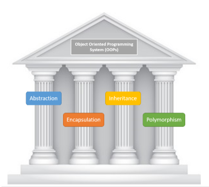

# Solid-Typescript-Exercise-Learning-Challenge

### Objective
Learn Typescript and SOLID Typescript.

# What are these 4 Pillars of OOP

## 1. Abstraction
I’m a coffee addict. So, when I wake up in the morning, I go into my kitchen, switch on the coffee machine and make coffee. Sounds familiar?
Making coffee with a coffee machine is a good example of abstraction.

You need to know how to use your coffee machine to make coffee. You need to provide water and coffee beans, switch it on and select the kind of coffee you want to get.

The thing you don’t need to know is how the coffee machine is working internally to brew a fresh cup of delicious coffee. You don’t need to know the ideal temperature of the water or the amount of ground coffee you need to use.

Someone else worried about that and created a coffee machine that now acts as an abstraction and hides all these details. You just interact with a simple interface that doesn’t require any knowledge about the internal implementation.

You can use the same concept in object-oriented programming languages like Java.

How to Create it With Abstraction

    Press button with the title "Make coffee" -> Yay! coffee

How to Create it Without Abstraction

    Have a button with the title "Boil the water"
    Have a button with the title "Add the cold water to the kettle"
    Have a button with the title "Add 1 spoon of ground coffee to a clean cup"
    Have a button with the title "Clean any dirty cups"
    And all the other buttons -> Boo! Still no coffee

## 2. Encapsulation

## Exercises
- [X] 0.S
- [X] 1.0
- [ ] 2.L
- [ ] 3.I
- [ ] 4.D
---

## exercise solutions
1. 0.S
    - 
    - 
    - 
    - 
    - 
    - Extra challenge TO-DO

2. 1.O
   - Make an Animal class so we can extend other child classes from this parent like Dog, Cat, Parrot and ur own made Animal {Saapjen}.
   - In the Animal class I pass three protected properties cause we will need to use these properties from derived classes. Properties: {name, type and sound}.
   - I import the Animal class inside the other classes. (import {Animal} from "./Animal";)
   - Afterwards we make sure that we export the class derived from the Animal class.
   - Inside every breed we make a constructor containing the protected properties from the Animal class.
   - In our new.ts file we all import all of our models
   - We make a new class Zoo (we make an empty array and make a method to addAnimal to this array)
   - Now we can make a new Zoo -> and add an animal with it's properties {example: zoo.addAnimal(new Cat("Nala", "Miaaaauw", "Cat"));}
   - After we loop over all the animals and print the animal type + the animal sound in our document.querySelector('#target').

3. 2.L

## Steps TO DO:
- Make an Animal class so we can extend other child classes from this parent like Dog, Cat, Parrot and ur own made Animal.
- In the Animal class I pass three protected properties cause we will need to use these properties from derived classes. Properties: {name, type and sound} 