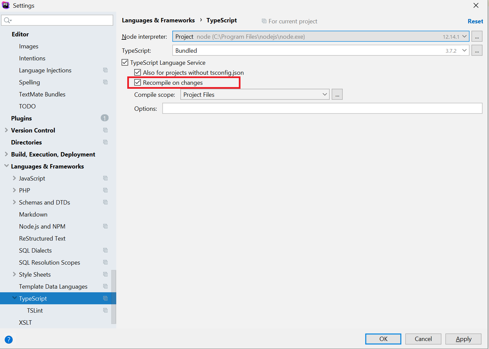
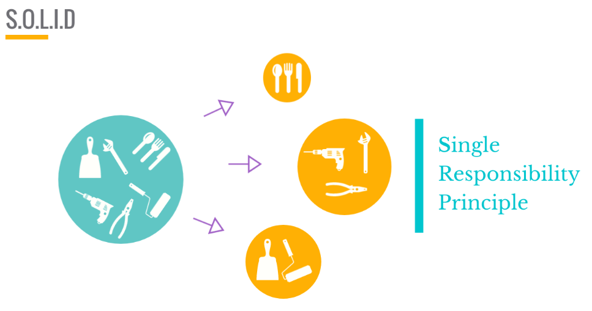
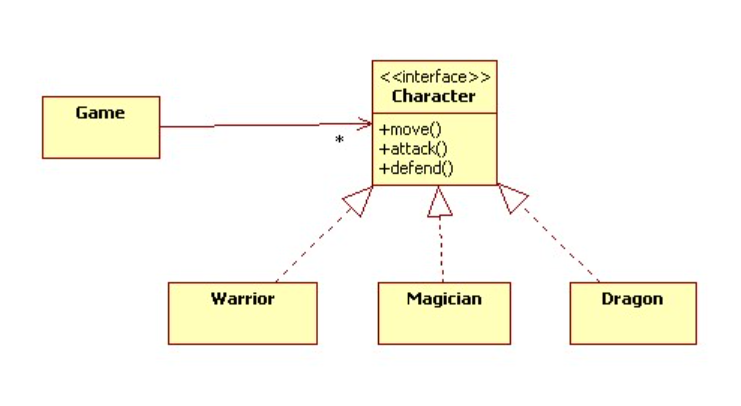
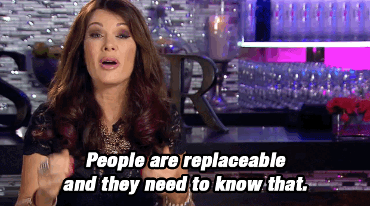
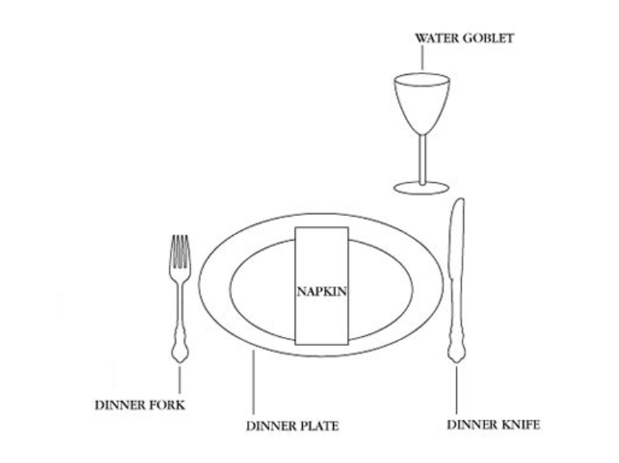
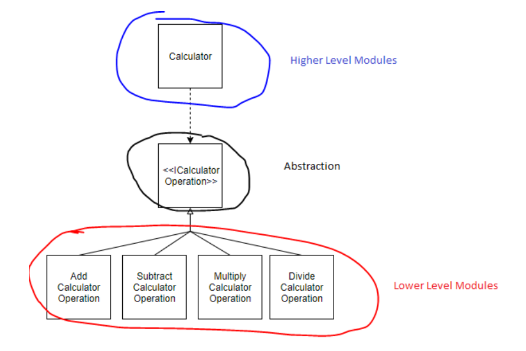

# Solid-Typescript-Exercise-Learning-Challenge

### Objective
Learn Typescript and SOLID Typescript.

### Installation
Typescript will transform all of your code to Javascript, making it work again in any browser (So all Typescript code is in the JS code). However, in order for this to work you will need to install a compiler.
Luckily this is rather simple, go to the [installation page](https://www.typescriptlang.org/download) and choose the option for your OS.

#### PhpStorm integration
At this point you should no longer be surprised, but PHPStorm comes with support for TypeScript out of the box. However, in order for this to work you might need to install [node.js](https://nodejs.org/en/).

There are 2 ways of working with TypesScript in your IDE, the first option is to make it so all TypeScript files are compiled the moment you change something in the file.
To do this go to ```File | Settings | Languages & Frameworks | TypeScript```. Make sure to check the correct checkbox.

 

Another option is to click on the "compile" button at the bottom of your editor. You can then either recompile the file your are currently in, or all files in the entire project.


### Working with Parcel
Parcel is a web application bundler, that will compile all the JS code

[You also need to install parcel](https://parceljs.org/getting-started/webapp/), after which you should be able to run `parcel index.html` in your project directory.

### SOLID
SOLID is a set of 5 principles that helps you write good OOP code, and is considered one of the leading theories for modern code. 
You can find the explanation on the end of the README file. First we will discuss OOP! 


# What are these 4 Pillars of OOP


## 1. Abstraction
I’m a coffee addict. So, when I wake up in the morning, I go into my kitchen, switch on the coffee machine and make coffee. Sounds familiar?
Making coffee with a coffee machine is a good example of abstraction.

You need to know how to use your coffee machine to make coffee. You need to provide water and coffee beans, switch it on and select the kind of coffee you want to get.

The thing you don’t need to know is how the coffee machine is working internally to brew a fresh cup of delicious coffee. You don’t need to know the ideal temperature of the water or the amount of ground coffee you need to use.

Someone else worried about that and created a coffee machine that now acts as an abstraction and hides all these details. You just interact with a simple interface that doesn’t require any knowledge about the internal implementation.

You can use the same concept in object-oriented programming languages like Java.

How to Create it With Abstraction

    Press button with the title "Make coffee" -> Yay! coffee

How to Create it Without Abstraction

    Have a button with the title "Boil the water"
    Have a button with the title "Add the cold water to the kettle"
    Have a button with the title "Add 1 spoon of ground coffee to a clean cup"
    Have a button with the title "Clean any dirty cups"
    And all the other buttons -> Boo! Still no coffee

## 2. Polymorphism
Imagine we have two animal classes, one class is called Dog, the other class is called Cat. Both classes should have the same properties and methods.
```js
class Dog {
public name: string;

constructor(name: string) {
this.name = name;
}

public makeSound(): void {
process.stdout.write('wuff wuff\n');
}
}

class Cat {
public name: string;

constructor(name: string) {
this.name = name;
}

public makeSound(): void {
process.stdout.write('meow meow\n');
}
}

const pocky: Cat = new Cat('Pocky');
pocky.makeSound(); // -> meow meow

const toshii: Dog = new Dog('Pocky');
toshii.makeSound(); // -> wuff wuff
```

This will work fine but actually this is NOT the WAY! 
Let me show u in Mandalorian Style the right way! 


As I said, both classes have the same properties and methods, so it makes sense to inherit this from a parent class.
Let’s have a look at a better way:

```js
class Animal {
public name: string;

constructor(name: string) {
this.name = name;
}

public makeSound(): void {
process.stdout.write('generic animal sound\n');
}
}

export class Dog extends Animal {
public makeSound(): void {
process.stdout.write('wuff wuff\n');
}
}

class Cat extends Animal {
public makeSound(): void {
process.stdout.write('meow meow\n');
}
}

const pocky: Cat = new Cat('Pocky');
pocky.makeSound(); // -> meow meow

const toshii: Dog = new Dog('Pocky');
toshii.makeSound(); // -> wuff wuff
```

## 3. Inheritance
A class can reuse the properties and methods of another class. This is called inheritance in TypeScript. The class which inherits properties and methods is called the child class. And the class whose properties and methods are inherited is known as the parent class.


I made a quick example explaining a single Inheritance in code:
```js
class Car {
private _color: string;

    constructor(color: string) {
        this._color = color;
    }
}

class Mercedes extends Car {
private _price: number;

    constructor(color: string, price: number) {
        super(color);
        this._price = price;
    }
}

let first = new Mercedes("black", 25000);
```

## 3. Encapsulation
The second concept of OOP is Encapsulation. Encapsulation is built on the idea of hiding data. This is where we restrict access to specific properties or methods.

In our example, the property _name is private. This means we can’t access this property from outside the class. To get access to this private property, we use the so-called getter and setter methods.
```js
class Character {
private _name: string;

constructor(name: string) {
this._name = name;
}

public get name(): string {
return this._name;
}

public set name(value: string) {
this._name = value;
}
}
```

## The Mission
This all probably means very little to you, which is why we are going to see each principle separably on small refactor exercises.

### Single Responsibility Principle
* [Single Responsibility Principle](SOLID/0.S/readme.md) — A class should have one, and only one, reason to change. Classes, software components and microservices that have only one responsibility are much easier to explain, understand and implement than the ones that provide a solution for everything. This reduces the number of bugs, improves your development speed, and makes your life as a software developer a lot easier. You can avoid these problems by asking a simple question before you make any changes: What is the responsibility of your class/component/microservice? 

If your answer includes the word “and”, you’re most likely breaking the single responsibility principle. Then it’s better to take a step back and rethink your current approach. There is most likely a better way to implement it.
  

### Open-Closed Principle
* [Open–closed principle](SOLID/1.O/readme.md) — Classes and other entities should be open for extension but closed for modification. The general idea of this principle is great. It tells you to write your code so that you will be able to add new functionality without changing the existing code. 

The Polymorphic Open/Closed Principles uses interfaces instead of superclasses to allow different implementations which you can easily substitute without changing the code that uses them. The interfaces are closed for modifications, and you can provide new implementations to extend the functionality of your software.


### Liskov Substitution Principle
* [Liskov Substitution Principle](SOLID/2.L/readme.md) — Objects should be replaceable by their subtypes. See also design by contract. = polymorpism. This principal is a bit of an extension on the last, and states that an object that is a subtype of another object should be able to be replaced by its “child”, and still function properly.

This essentially states that nothing in a child should alter the code it is inheriting from it’s parent, or, it should not be able to change any of the code or functionality inside of its parent.



### Interface Segregation Principle
* [Interface Segregation Principle](SOLID/3.I/readme.md) — Interfaces should be client specific rather than general. This principal is similar to the first one, however it has a focus on the client side of programming. Like with functions or methods, clients shouldn’t have access to the entire interface if it is not necessary for them.

Instead it is recommended that, like classes, you break an interface into smaller parts, and offer only what is needed at the time. This not only makes the client experience a lot cleaner and easier, but it also makes your project so much easier to clean and update.

- To make it simple in the beginning let's try to start with a setup like this though:
  

### Dependency Inversion Principle
* [Dependency Inversion Principle](SOLID/4.D/readme.md) — Depend on abstractions rather than concretions. This principal is probably the most difficult to understand, and is unfortunately perhaps the most essential!

This principal states that when building a project, classes will likely fall into one of two categories: high level classes that are involved more with the functionality (forking, spooning, business interactions) or low level classes that deal with things like disk access or network protocols. To bring out Utensil game into this. This principal could perhaps be thought of using a chef, a client, and a waiter as a metaphor. A waiter acts as that layer of abstraction between the chef and the client so that a client isn’t expected to go into the kitchen to get their food from the chef! If the chef is changed, maybe the client will not know who to get their food from! If the client switches tables, how will the chef know where to bring the food!?

Enter the waiter. The waiter acts as the level of abstraction between the server and the client. Both people can function at their jobs: chef cooks, client eats, without the two ever coming into contact.

This principal creates a project that is way more flexible and easier to debug!



## Tips
- [Read more about solid](https://medium.com/@severinperez/maintainable-code-and-the-open-closed-principle-b088c737262)
- [TypeScript with Solid principles](https://itnext.io/brutally-solid-typescript-ba745585f440)

## Exercises
- [X] 0.S
- [X] 1.0
- [X] 2.L
- [X] 3.I
- [ ] 4.D
---

## exercise solutions
1. 0.S
    - Make an Engine and Radio class.
    - Inside the Car class we make properties Engine and Radio and set this private readonly.
    - Make a constructor for the Fuel in the Engine class.
    - Setters and getters inside the classes!
    - Inside the Engine class we make 2 methods addFuel and addMileage

2. 1.O
   - Make an Animal class, so we can extend other child classes from this parent like Dog, Cat, Parrot and ur own made Animal {Saapjen}.
   - In the Animal class I pass three protected properties because we will need to use these properties from derived classes. Properties: {name, type and sound}.
   - I import the Animal class inside the other classes. (import {Animal} from "./Animal";)
   - Afterwards we make sure that we export the class derived from the Animal class.
   - Inside every breed we make a constructor containing the protected properties from the Animal class.
   - In our new.ts file we all import all of our models
   - We make a new class Zoo (we make an empty array and make a method to addAnimal to this array)
   - Now we can make a new Zoo -> and add an animal with its properties {example: zoo.addAnimal(new Cat("Nala", "Miaaaauw", "Cat"));}
   - After we loop over all the animals and print the animal type + the animal sound in our document.querySelector('#target').

3. 2.L
   - In this Exercise I had to go lookup what an interface is -> This can have properties but also Methods
   - So we take the two methods to calculate the discounts called "apply" and "showCalculation" from the old.ts and put them in the interface
   - Afterwards we can make a class Discount with a value and a constructor
   - We can now make our first variableDiscount class and extend it from the parent Discount class and implement the interface
   - Inside these classes we can now call those methods from the interface and tell them what we want them to do
   - We do the same for the "fixedDiscount" and "noDiscount" class!

4. 3.I
   - First I made all the export interfaces for Password / Facebook / Google.
   - Afterwards I've made separated classes for the User / Admin / Bot and made sure all interfaces were imported and also the classes are exported, so we can use them inside our new.ts for the Logic.
   - Made the new.ts file and imported all the models I've made in the previous step.
   - In the new.ts file we add all the "query-selectors" and we make a function to start listening to the login form.
   - Here I copied the switch statement from the old.ts and replaced the conditions for every possible login format.

5. 4.D
   - I first made a Schema for myself how I would make the interface and classes work with each other.
   - Made the mistake at first and adjusted a long the way the interface and classes. 
   - First made an Oven class and added two public functions on | off that would call another function to light or extinguish the gas.
   - Then made the ElectricOven and did the same only changed the name of the functions. 
   - Made an interface with 3 methods (on, off and bake).
   - Added the Restaurant with 2 properties (name, and type of oven), also added the cooking function and changed it to my interface.
   - in the New.ts we can now call the new restaurant + a new oven and let it use to cook function.  

   
## Things I've learned
   - SOLID principles in and out.
   - How to properly code with OOP.
   - Several Errors in the browser (exports could not be defined, failed to load modules).
   - Using Parcel and why we need it.

## The END
