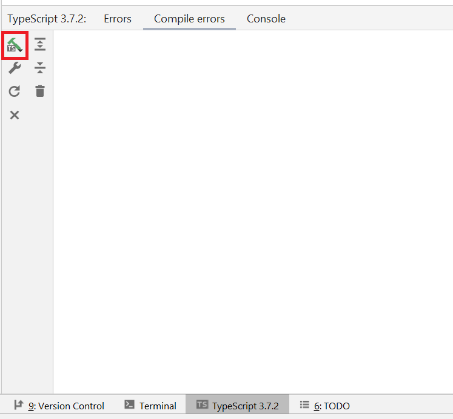

# Solid-Typescript-Exercise-Learning-Challenge

### Objective
Learn Typescript and SOLID Typescript.

### Installation
Typescript will transform all of your code to Javascript, making it work again in any browser (So all Typescript code is in the JS code). However, in order for this to work you will need to install a compiler.
Luckily this is rather simple, go to the [installation page](https://www.typescriptlang.org/download) and choose the option for your OS.

#### PhpStorm integration
At this point you should no longer be surprised, but PHPStorm comes with support for TypeScript out of the box. However, in order for this to work you might need to install [node.js](https://nodejs.org/en/).

There are 2 ways of working with TypesScript in your IDE, the first option is to make it so all TypeScript files are compiled the moment you change something in the file.
To do this go to ```File | Settings | Languages & Frameworks | TypeScript```. Make sure to check the correct checkbox.


Another option is to click on the "compile" button at the bottom of your editor. You can then either recompile the file your are currently in, or all files in the entire project.


### Working with Parcel
Parcel is a web application bundler, that will compile all the JS code

[You also need to install parcel](https://parceljs.org/getting-started/webapp/), after which you should be able to run `parcel index.html` in your project directory.

### SOLID
SOLID is a set of 5 principles that helps you write good OOP code, and is considered one of the leading theories for modern code.


# What are these 4 Pillars of OOP


## 1. Abstraction
I’m a coffee addict. So, when I wake up in the morning, I go into my kitchen, switch on the coffee machine and make coffee. Sounds familiar?
Making coffee with a coffee machine is a good example of abstraction.

You need to know how to use your coffee machine to make coffee. You need to provide water and coffee beans, switch it on and select the kind of coffee you want to get.

The thing you don’t need to know is how the coffee machine is working internally to brew a fresh cup of delicious coffee. You don’t need to know the ideal temperature of the water or the amount of ground coffee you need to use.

Someone else worried about that and created a coffee machine that now acts as an abstraction and hides all these details. You just interact with a simple interface that doesn’t require any knowledge about the internal implementation.

You can use the same concept in object-oriented programming languages like Java.

How to Create it With Abstraction

    Press button with the title "Make coffee" -> Yay! coffee

How to Create it Without Abstraction

    Have a button with the title "Boil the water"
    Have a button with the title "Add the cold water to the kettle"
    Have a button with the title "Add 1 spoon of ground coffee to a clean cup"
    Have a button with the title "Clean any dirty cups"
    And all the other buttons -> Boo! Still no coffee

## 2. Polymorphism
Imagine we have two animal classes, one class is called Dog, the other class is called Cat. Both classes should have the same properties and methods.
```js
class Dog {
public name: string;

constructor(name: string) {
this.name = name;
}

public makeSound(): void {
process.stdout.write('wuff wuff\n');
}
}

class Cat {
public name: string;

constructor(name: string) {
this.name = name;
}

public makeSound(): void {
process.stdout.write('meow meow\n');
}
}

const pocky: Cat = new Cat('Pocky');
pocky.makeSound(); // -> meow meow

const toshii: Dog = new Dog('Pocky');
toshii.makeSound(); // -> wuff wuff
```

This will work fine but actually this is NOT the WAY! 
Let me show u in Mandalorian Style the right way! 


As I said, both classes have the same properties and methods, so it makes sense to inherit this from a parent class.
Let’s have a look at a better way:

```js
class Animal {
public name: string;

constructor(name: string) {
this.name = name;
}

public makeSound(): void {
process.stdout.write('generic animal sound\n');
}
}

export class Dog extends Animal {
public makeSound(): void {
process.stdout.write('wuff wuff\n');
}
}

class Cat extends Animal {
public makeSound(): void {
process.stdout.write('meow meow\n');
}
}

const pocky: Cat = new Cat('Pocky');
pocky.makeSound(); // -> meow meow

const toshii: Dog = new Dog('Pocky');
toshii.makeSound(); // -> wuff wuff
```
Jeez! This looks alot like our Exercise 1.O :)

## 3. Inheritance
A class can reuse the properties and methods of another class. This is called inheritance in TypeScript. The class which inherits properties and methods is called the child class. And the class whose properties and methods are inherited is known as the parent class.


I made a quick example explaining a single Inheritance in code:
```js
class Car {
private _color: string;

    constructor(color: string) {
        this._color = color;
    }
}

class Mercedes extends Car {
private _price: number;

    constructor(color: string, price: number) {
        super(color);
        this._price = price;
    }
}

let first = new Mercedes("black", 25000);
```

## 3. Encapsulation
The second concept of OOP is Encapsulation. Encapsulation is built on the idea of hiding data. This is where we restrict access to specific properties or methods.

In our example, the property _name is private. This means we can’t access this property from outside the class. To get access to this private property, we use the so-called getter and setter methods.
```js
class Character {
private _name: string;

constructor(name: string) {
this._name = name;
}

public get name(): string {
return this._name;
}

public set name(value: string) {
this._name = value;
}
}
```

## The Mission
This all probably means very little to you, which is why we are going to see each principle separably on small refactor exercises.

* [Single Responsibility Principle](SOLID/0.S/readme.md) — Classes should have a single responsibility and thus only a single reason to change.
* [Open–closed principle](SOLID/1.O/readme.md) — Classes and other entities should be open for extension but closed for modification.
* [Liskov Substitution Principle](SOLID/2.L/readme.md) — Objects should be replaceable by their subtypes. See also design by contract. = polymorpism
* [Interface Segregation Principle](SOLID/3.I/readme.md) — Interfaces should be client specific rather than general.
* [Dependency Inversion Principle](SOLID/4.D/readme.md) — Depend on abstractions rather than concretions.

## Tips
- [Read more about solid](https://medium.com/@severinperez/maintainable-code-and-the-open-closed-principle-b088c737262)
- [TypeScript with Solid principles](https://itnext.io/brutally-solid-typescript-ba745585f440)

## Exercises
- [X] 0.S
- [X] 1.0
- [ ] 2.L
- [ ] 3.I
- [ ] 4.D
---

## exercise solutions
1. 0.S
    - Make an Engine and Radio class.
    - Inside the Car class we make properties Engine and Radio and set this private readonly.
    - Make a constructor for the Fuel in the Engine class.
    - Setters and getters inside the classes!
    - Inside the Engine class we make 2 methods addFuel and addMileage

2. 1.O
   - Make an Animal class so we can extend other child classes from this parent like Dog, Cat, Parrot and ur own made Animal {Saapjen}.
   - In the Animal class I pass three protected properties cause we will need to use these properties from derived classes. Properties: {name, type and sound}.
   - I import the Animal class inside the other classes. (import {Animal} from "./Animal";)
   - Afterwards we make sure that we export the class derived from the Animal class.
   - Inside every breed we make a constructor containing the protected properties from the Animal class.
   - In our new.ts file we all import all of our models
   - We make a new class Zoo (we make an empty array and make a method to addAnimal to this array)
   - Now we can make a new Zoo -> and add an animal with it's properties {example: zoo.addAnimal(new Cat("Nala", "Miaaaauw", "Cat"));}
   - After we loop over all the animals and print the animal type + the animal sound in our document.querySelector('#target').

3. 2.L
   -